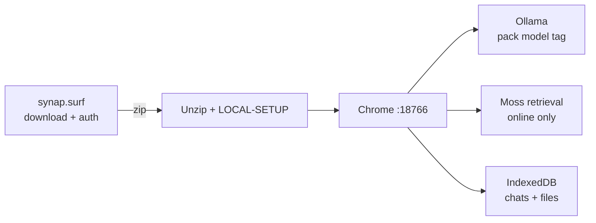
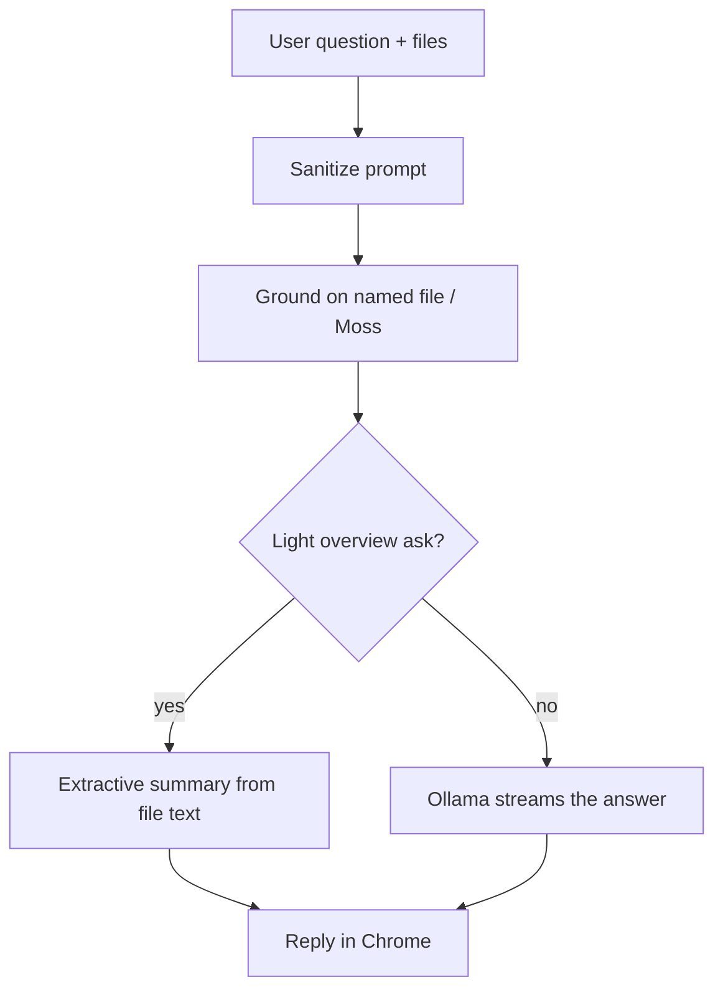

# Surf AI

Local-first file chat for the **YC × Moss Local-First / Small Cloud** track.

**License:** proprietary [Synap Developer License](LICENSE).

## How it works

`synap.surf` is a thin shell (landing, login, download). **AI never runs on the website.** Users download a zip, run one setup command on their laptop, and chat in Chrome on `127.0.0.1:18766` with **Ollama**.



### From ask to answer



| Layer | Role |
|---|---|
| **Download pack** | `local-agent.html`, `LOCAL-SETUP`, `agent.json` (model tag) |
| **Ollama** | Writes every answer (e.g. `llama3.2:1b`, `qwen2.5:1.5b`, `llama3.2:3b`) |
| **Moss** | Pulls text snippets into context when online; paused offline |
| **Named-file focus** | “harbour about” uses that zip only — not a sibling résumé |
| **Extractive path** | Tiny models + “what is this file” → teach from text, skip weak generation |

Prompts stay on the laptop. The VPS never sees chat bodies.

## Use it

1. Open `/download` → pick a model → download the zip  
2. Unzip → run `LOCAL-SETUP` (or `SURF-OPEN`)  
3. Chrome opens local chat — attach files and ask  

## Layout

```
apps/web     Site shell + pack assets
apps/host    Auth / OTP / feedback only
harness/     Evals (file-focus, zip, guardrails)
```
