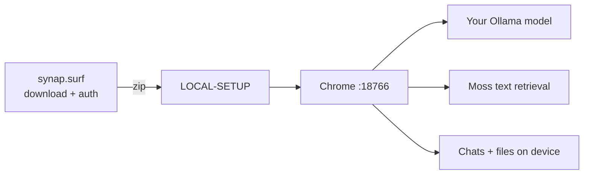
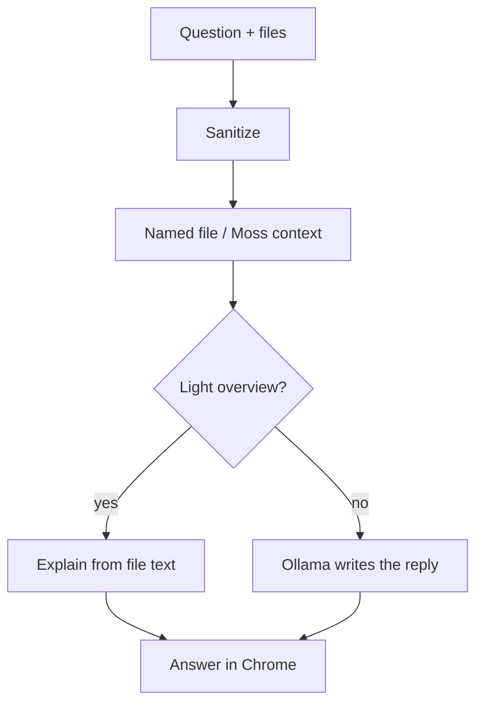

# Surf AI

Local-first file chat for the **YC × Moss Local-First / Small Cloud** track.

**License:** proprietary [Synap Developer License](LICENSE).

## Problem we solve

Most “AI for your files” products send documents and prompts to a cloud model. That is hard for teams that need privacy, work offline, or cannot pay per token.

Surf flips that: **your files and answers stay on your computer.** The website only helps you download a small pack. Anyone who can unzip a folder and run one command can use it—no cloud API key for chat.


| Who                | What they get                                                                                      |
| ------------------ | -------------------------------------------------------------------------------------------------- |
| **Non-developer**  | Download → run setup → chat with PDFs, Excel, zips in Chrome                                       |
| **Engineer**       | Same pack is editable (`agent.json`, harness cases, prompts) and can grow with bigger local models |
| **Team / product** | One design that scales from a 1B laptop model to larger Ollama tags without changing the website   |


## Why this design

1. **Thin website, thick laptop** — Cloud hosting stays cheap and private: no chat bodies on the VPS.
2. **One zip, one command** — `LOCAL-SETUP` installs Ollama, pulls the chosen model, opens chat. Low friction for non-engineers.
3. **Model is a pack setting** — Swap RAM tier on `/download` or edit `agent.json`; no redeploy of `synap.surf` to try a new local model.
4. **Grounded answers** — Retrieval + named-file focus so “what is harbour about?” does not dump a sibling résumé.
5. **Fine-tune / scale locally** — Start small (1B–1.5B), move to 3B/7B+ on stronger machines, or point Ollama at a custom/fine-tuned tag—the UI path stays the same.




## How an ask becomes an answer




## Adapt it to your needs

**Non-developer**

1. `/download` → pick a model size for your laptop → download
2. Unzip → run `LOCAL-SETUP` (or `SURF-OPEN`)
3. Attach files and ask in Chrome

**Engineer — change the model (fine-tune / scale)**

Packs bake the Ollama tag into `agent.json`. Change the tag (stock or your fine-tuned model), then re-run setup so Ollama pulls it:

```json
{
  "agent": "ollama",
  "model": "llama3.2:3b",
  "modelTitle": "Llama 3.2 3B"
}
```

Or build a new zip from `/download` with a larger RAM tier. Same chat UI; only the local writer changes.

**Engineer — why the site never runs the model**

```ts
// apps/web/src/lib/browserCaps.ts
// synap.surf → false: AI must use Download zip → Ollama on the laptop
export function allowInBrowserLlm(): boolean {
  const h = location.hostname.toLowerCase();
  if (h === "localhost" || h === "127.0.0.1") return true; // optional local demo only
  return false;
}
```

**Engineer — named-file grounding (correct file, not the wrong sibling)**

```ts
// apps/web/src/lib/groundedContext.ts
// "harbour file about" → only harbour-*.zip context
export function filesNamedInAsk(files, query) {
  const q = query.toLowerCase();
  return files.filter((f) => /* basename tokens appear in the ask */);
}
```

**Engineer — verify your changes**

```bash
python3 harness/evals/test_file_focus.py
python3 harness/evals/test_zip_and_summary.py
# inside an unzipped pack:
bash harness/run-evals.sh
```

## Layout

```
apps/web     Site shell + download packs
apps/host    Auth / OTP / feedback only (no chat)
harness/     Evals for file focus, zip unpack, guardrails
```

