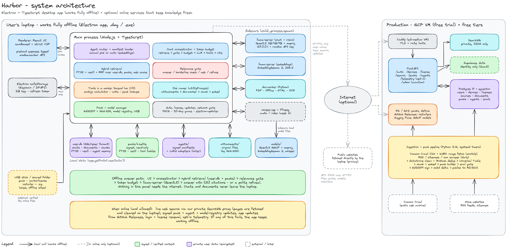
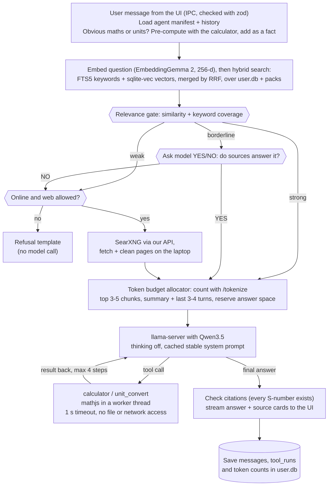
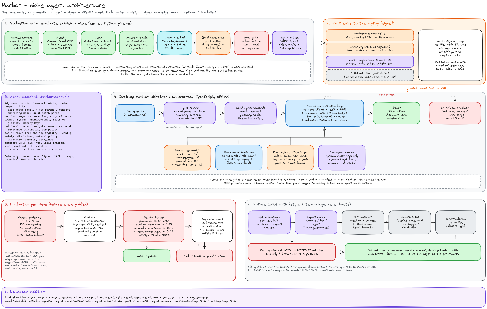

# Surf AI: Architecture, Short Version
## Local-first offline AI assistant (Electron edition, v0.2, 9 October 2026)

> **"Works offline. Stays up to date when you're online."**

This is the **short version** (about 20 pages). It covers what you need to understand, build and talk about the product. The **full reference** (`ARCHITECTURE-FULL.md` / `.pdf`) has every detail: full table definitions, edge cases, security notes, code listings and all links. Tested code lives in `code-samples/` (Python pipeline) and `code-samples/ts/` (TypeScript desktop code). `CURSOR_PROMPT.md` has the first prompt and the project rule for building it with Cursor.

---

## 1. Overview (one page)

**What Surf AI is.** A desktop app for Mac and Windows. You chat with an AI model that runs **on your own computer**. It answers from your own documents and from downloadable **knowledge packs**, which are signed, offline bundles of trusted sources. Every answer shows **citations**. When the sources do not support an answer, Surf AI says so instead of guessing. When you are online, it can also search the web and update its packs in the background.

**Who it's for.** Phase 1 is a general assistant. After that come **niche agents** (expert modes), starting with **Marine Engineer**, built for people who often work with no internet, such as crews at sea. Construction, aviation and others follow later.

**The core ideas**

1. **Offline is the default, not a fallback.** Chat, search over your documents, packs, the calculator and login (with a 30-day grace period) all work without internet.
2. **Private by design.** Chats and documents stay on the laptop in an encrypted database. The server never sees your prompts. Web search goes through our own private search proxy, and the laptop fetches the pages itself.
3. **Grounded answers.** The app finds sources first and checks that they are relevant (the **relevance gate**). The model must cite them as [S1], [S2] and so on. If the sources are weak, the app shows a polite refusal (or searches the web when online).
4. **Numbers are computed, not guessed.** Arithmetic and unit conversions go to a sandboxed **calculator tool**.
5. **Small models, used carefully.** Qwen3.5 4B or 9B runs on normal laptops. A **token budget** keeps every request inside the model's working memory.
6. **Same machinery for every niche.** An agent is just a signed *manifest* (prompt, tools, rules) plus signed packs. There is no new code per niche.

**Why it can be built in 7 days.** Everything is TypeScript (desktop) or Python (doc conversion and server pipeline), using proven open-source parts: Electron, llama.cpp, SQLite, Postgres, SearXNG and Supabase Auth. The riskiest parts were tested in advance (section 10).

**Jargon in one line each**
- **Electron:** builds desktop apps with web technology (Chromium + Node.js).
- **Main process:** the Node.js part of Electron with full system access, where our "local backend" lives.
- **Renderer:** the web page you see (React).
- **Preload:** a small, safe bridge between the renderer and the main process.
- **IPC:** messages between those processes.
- **llama-server:** a small local web server from llama.cpp that runs the model.
- **GGUF:** the model file format.
- **Q4_K_M:** a 4-bit compression level.
- **mmproj:** the extra file that lets the model see images.
- **Embedding:** a list of numbers that captures meaning, so similar texts can be found.
- **RAG:** retrieval-augmented generation, meaning "find sources, then answer from them".
- **Token:** a piece of a word. Models count in tokens.
- **Context window:** how many tokens the model can see at once.
- **SQLCipher:** an encrypted SQLite format.
- **sqlite-vec:** vector search inside SQLite.
- **FTS5:** SQLite's keyword search.

---

## 2. System architecture



*Figure 1. Everything on the left runs on the laptop and works offline. The right side holds the optional online services on one Google Cloud VM, plus free tiers.*

**How the pieces fit**

- **Renderer (React UI).** Sandboxed and locked down with a strict Content Security Policy. It can only call a small, typed API (`window.surf`) that the **preload** script exposes.
- **Main process (TypeScript).** The brain of the app. It runs the chat orchestrator, retrieval, relevance gate, token budget, tools, the database, pack and model manager, auth, and updates.
- **Sidecars.** Separate programs the main process starts and watches (`child_process.spawn`):
  - `llama-server` for chat (Qwen3.5, plus `mmproj` for images);
  - a second `llama-server` for embeddings (EmbeddingGemma 2, 256-d);
  - the Python **doc-worker** that turns PDFs, Office files, HTML and images into text;
  - whisper.cpp + FFmpeg for audio (week 2).

  They all listen only on `127.0.0.1` and use a random API key.
- **Local data.**
  - `user.db`: encrypted SQLite (SQLCipher format) with chats, documents, chunks, keyword index and vector index. Its key is protected by the operating system through Electron **safeStorage** (Keychain on Mac, DPAPI on Windows).
  - `packs/*.sqlite`: signed, read-only knowledge packs.
  - `models/`: the downloaded model files.
- **Online (optional).**
  - **FastAPI** for accounts, devices, licences, search proxy, pack and agent catalogue.
  - **Postgres + pgvector** for the server data and corpus.
  - **SearXNG**, a private meta-search engine.
  - All three run in Docker Compose on one GCP VM behind Caddy (HTTPS).
  - **Supabase Auth** handles login.
  - Packs live on **Cloudflare R2** (or Google Cloud Storage), installers on **GitHub Releases**, and models are downloaded straight from **Hugging Face**.

**The six main flows** (details in the full doc, §2)

1. **Offline chat:** UI → main process → retrieve → gate → token budget → local model → answer with citations.
2. **Attachment:** a file is copied in, the doc-worker extracts text, then it is chunked, embedded and indexed in `user.db`.
3. **Online answer:** if the gate fails and you are online and web search is allowed, our SearXNG proxy returns links. The laptop fetches and cleans the pages, then answers with "From the web" citations.
4. **Pack update:** check every 6 hours, download, verify the Ed25519 signature and SHA-256 checksums, then swap the files in one step. The same works from a USB stick.
5. **Login:** done once online in the system browser (PKCE). The app then holds a signed device licence valid for 30 days offline.
6. **App update:** electron-updater uses GitHub Releases. Offline, use "Install update from file…" with a signed installer.

---

## 3. Tech stack

| Layer | Choice | Why (short) |
|---|---|---|
| Desktop shell | **Electron 44** + **electron-vite** (build) + **electron-builder** (installers) | All TypeScript, no Rust needed. electron-builder makes `.dmg` (Apple Silicon + Intel) and `.exe` (NSIS) and handles notarisation and auto-update. Electron Forge's Vite support is still "experimental". Tauri is the alternative considered and a possible later migration (full doc §3.4). |
| UI | **React + TypeScript + Vite** | Huge ecosystem; Cursor knows it well. |
| Local model server | **llama.cpp `llama-server`** (pinned build, e.g. b11514) | Runs GGUF models on CPU, Apple Metal or GPU; OpenAI-style API; tool calling; vision through `--mmproj`; `/tokenize` for exact token counts. |
| Chat models | **Qwen3.5-4B** (8 GB laptops), **Qwen3.5-9B** (16 GB+), **Qwen3.5-2B** fallback; Q4_K_M GGUF from unsloth | Apache-2.0, strong for their size, tool calling, 201 languages, and the same family understands images with `mmproj`. Chosen through a **model registry**, so upgrading is a data change. |
| Embeddings | **EmbeddingGemma 2**, text-only 270M part (Q8_0 GGUF, 310 MB, Apache-2.0), vectors cut from 768 to **256** numbers | Multilingual (100+ languages), on-device sized, near-full quality at 256-d. Needs llama.cpp ≥ b11452. Its image/audio encoders are a later upgrade. |
| Local database | **SQLite** through `better-sqlite3-multiple-ciphers` (SQLCipher mode) + **sqlite-vec** + **FTS5** | One encrypted file holds chats, keyword search and vector search. Tested: opens in the official `sqlcipher` tool. |
| Key storage | Electron **safeStorage** | Uses the operating system's keychain or DPAPI; no password prompts. |
| Calculator tool | **mathjs** in a **worker thread** (dangerous functions disabled, 1 s timeout, 64 MB limit) | Exact maths and units (knots, nautical miles, lakh, crore…). No `eval`. |
| Document conversion | **Python doc-worker** (pypdfium2, MarkItDown, RapidOCR), packaged with PyInstaller | The best open-source file converters are in Python. |
| Token counting | llama-server **`/tokenize`** (exact) or **@huggingface/tokenizers** with Qwen3.5's `tokenizer.json` | Uses the model's own tokenizer. tiktoken is only an approximation for Qwen. |
| Hardware detection | Node `os` + **systeminformation** | RAM, CPU, GPU, then a tier. |
| Backend API | **FastAPI** (Python) | Simple, typed, shares code with the pipeline. |
| Server database | **Postgres 17 + pgvector** (Docker on the VM) | Users, devices, sources, corpus, packs, agents, evals. |
| Web search | **SearXNG** (self-hosted, JSON only, no query logs) | Private, free, no API keys. |
| Hosting | **GCP e2-medium VM** in Mumbai (`asia-south1`), Docker Compose + Caddy | Paid for by the $300 free trial for about 3 months. |
| Login | **Supabase Auth** (free tier, 50,000 monthly active users) | Email OTP + Google; we don't store passwords. |
| File hosting | **GitHub Releases** (installers), **Hugging Face** (models), **Cloudflare R2** or **GCS** (packs) | Free, or close to free. R2 has no download (egress) fees. |
| Signing | **Ed25519** (Node `crypto` / PyNaCl) for packs, agents, licences and offline installers | Tiny keys; tamper-proof content. |
| Pipeline | Common Crawl + RSS/sitemaps → **datatrove** → pack builder | Free public web data, cleaned and deduplicated. |

**Model files (downloaded on first launch, with resume and SHA-256 check).** All files are Apache-2.0 except whisper (MIT).

| Tier | Machine | Chat model file | Size | Vision file (mmproj-F16) |
|---|---|---|---|---|
| 0 | < 8 GB RAM | `unsloth/Qwen3.5-2B-GGUF` / `Qwen3.5-2B-Q4_K_M.gguf` | 1.28 GB | 0.67 GB |
| 1 | 8 GB | `unsloth/Qwen3.5-4B-GGUF` / `Qwen3.5-4B-Q4_K_M.gguf` | 2.74 GB | 0.67 GB |
| 2 | 16 GB | `unsloth/Qwen3.5-9B-GGUF` / `Qwen3.5-9B-Q4_K_M.gguf` | 5.68 GB | 0.92 GB |
| 3 | 32 GB+ | `Qwen3.5-9B-Q8_0.gguf` (optional) | 9.53 GB | 0.92 GB |
| all | — | `unsloth/embeddinggemma-2-GGUF` / `embeddinggemma-2-Q8_0.gguf` (embeddings) | 310 MB | — |

**Speech:** whisper.cpp base Q8_0 (82 MB) on tiers 0–1, small Q8_0 (264 MB) on tier 2, large-v3-turbo Q5_0 (574 MB) on tier 3.

**Why not other models.**
- **Gemma 4 E4B** (Apache-2.0, can also hear audio) is the alternative considered, but its files are larger for the 8 GB tier.
- Phi-4-mini is text-only and covers fewer languages.
- Llama 3.2 3B has a custom licence and gated downloads, which complicate automatic first-launch download.
- Qwen3.8 ships only in sizes of 27B and up.
- A newer model date does not mean newer knowledge (Gemma 4's data stops in January 2025), so facts must come from packs and the web.

---

## 4. Chat orchestration

This happens for every message, inside the main process.



*Figure 2. Chat orchestration: retrieval, relevance gate, token budget and calculator tool.*

**Relevance gate.** The app decides *before* the model runs:
- **Answer:** the best vector similarity is at least τ (start at 0.70 for EmbeddingGemma 2 at 256-d; unrelated text scores about 0.5) and the keyword coverage is at least 0.5.
- **Borderline:** the scores are close to the line, so the app asks the model a one-word YES/NO question.
- **Insufficient:** the app goes to the web (when online and allowed) or shows a refusal template.

The refusal never uses the model, so it cannot invent anything. τ must be calibrated on a set of test questions.

**Calculator tool.** Two tools are offered to the model:
- `calculator {expression}` (e.g. `23.7 * 17.5`)
- `unit_convert {value, from, to}` (e.g. 14 knots → km/h)

They run in **mathjs** inside a separate worker thread, with risky functions removed (`import`, `evaluate`, `parse`, `createUnit`…), a 500-character limit and a 1-second timeout. Custom units: knot, nautical mile, lakh, crore. Tested: the model called both tools and answered "414.75 tonnes … 25.93 km/h".

**Token budget.** Small models have small working memory. If a request is too long, llama-server silently drops the beginning, which is usually the important rules. So the allocator counts tokens per part and trims before sending:

| Part | 8 GB tier | 16 GB tier |
|---|---|---|
| Whole request | 4,096 | 8,192 |
| System prompt + tool schemas | ~400 | ~700 |
| Retrieved chunks (top 3–5, 200–300 words each, reranked, de-duplicated, above threshold) | ~1,500 | ~3,000 |
| Conversation history (summary of old turns + last 3–4 turns) | ~1,000 | ~2,200 |
| Question | ~300 | ~800 |
| Kept free for the answer | ≥ 800 | ≥ 1,500 |
| llama-server context (`-c`), one slot (`-np 1`) | 8,192 | 16,384 |

**Budget rules**
- The system prompt is **stable** (same text every time), so llama-server can reuse its cached computation (`cache_prompt`). Sources go in the user message, not in the system prompt.
- Tool schemas are sent only when the question might need them.
- Attachments are never pasted whole; only their best chunks are used.
- **Thinking mode is off** by default (`enable_thinking: false`).
- The context is 8K–16K, not the model's 262K maximum.
- A hidden developer view logs one line per request, for example:

  `system=60 tools=163 retrieved=1159 summary=15 history=657 question=18 answerReserve=2024 total=4096`

  This line comes from the real test run. Prompts themselves are never logged.

---

## 5. Data model (main tables only)

Full table definitions are in `code-samples/local_user_db.sql`, `pack_db.sql` and `production_postgres.sql`, and the diagram is `database-models.png`.

### 5.1 On the laptop: `user.db` (encrypted, never uploaded)

| Table | Main columns | Purpose |
|---|---|---|
| `conversations` | id, title, agent_id, model_id, web_allowed, summary, updated_at | One chat thread; `summary` is the rolling summary used by the token budget. |
| `messages` | id, conversation_id, role, content, citations_json, tool_calls_json, gate_decision, tokens_in, tokens_out | Every turn, with citations and token counts. |
| `tool_runs` | id, message_id, tool_name, args_json, result_json, status, duration_ms | Audit of calculator and other tool calls. |
| `attachments` | id, original_name, mime, size_bytes, stored_path, conversation_id | Files you added (stored by SHA-256). |
| `documents` | id, attachment_id, source_type, title, url, page_count, status | Extracted documents (attachments + web pages). |
| `chunks` | id, document_id, ord, heading, text, token_count, page_start | ~200–300-word pieces used for retrieval. |
| `chunks_fts` / `chunk_vectors` | FTS5 index on text / vec0 index (256-d embedding) | Keyword search / vector search. |
| `packs` | pack_id, version, niche, status, path, signature, embedding_model | Installed knowledge packs. |
| `installed_agents` | agent_id, version, manifest_json, signature, status | Installed niche agents. |
| `agent_memory` | agent_id, key, value, source_message_id | Facts you confirmed, e.g. "my main engine is …". |
| `models` | id, kind, family, file_name, quant, size_bytes, license, status | Downloaded model files. |
| `web_cache`, `sync_state`, `feedback` | url, fetched_at, expires_at / key, etag, last_success_at / rating | Web pages, update checks, thumbs up/down. |

**Pack file** (`pack.sqlite`, signed, read-only): `pack_meta`, `sources`, `documents`, `chunks`, `chunks_fts`, `chunk_vec`, plus optional tool tables (e.g. `fault_codes`).

### 5.2 On the server: Postgres + pgvector

| Group | Tables (main columns) |
|---|---|
| Accounts | `users` (email, plan_code, telemetry_opt_in), `devices` (user_id, os, arch, hw_tier, device_pubkey), `device_licenses` (device_id, features, expires_at, revoked_at), `auth_refresh_tokens`, `plans`, `subscriptions` |
| Sources & crawling | `niches`, `sources` (domain, feed_url, trust_level 1–5, license, **redistribution** full/excerpt/link_only), `crawl_runs` (kind cc/rss, status, stats), `raw_documents` (url, warc_filename, warc_offset, warc_length) |
| Universal Table (the corpus) | `documents` (doc_uid, version, is_current, url, title, text, lang, quality, tags), `chunks` (document_id, ord, text, token_count), `chunk_embeddings` (chunk_id, embedding_model_id, embedding vector(256)), `embedding_models` |
| Packs | `packs` (niche_id, title, target_size_mb), `pack_versions` (version, embedding_model_id, chunk_count, manifest, signature, eval_run_id), `pack_files` (role, size_bytes, sha256), `pack_deltas`, `device_pack_installs` |
| Agents & evaluation | `agents`, `agent_versions` (manifest, signature, base_model_req, required_packs), `tools`, `agent_tools`, `eval_sets`, `eval_items`, `eval_runs` (metrics, thresholds), `eval_results`, `training_examples` (consent required) |
| Search | `search_requests` (no query text stored), `search_quota_daily` (device_id, day, count) |

---

## 6. Ingestion pipelines

### 6.1 Server: building knowledge packs (Python, on the VM)

1. **Curate sources.** A curator and a domain expert add trusted sites to `sources` with a trust level, licence and **redistribution** policy. The policy decides whether we may ship full text, excerpts only, or links only.
2. **Discover and fetch.**
   - *Monthly:* the Common Crawl index (CDX) is queried per domain, and only the needed WARC records are downloaded by byte range (`cc_fetch.py`).
   - *Daily:* RSS feeds and sitemaps catch new pages (`rss_scrape.py`, robots.txt respected).
3. **Clean** with datatrove (`dt_clean.py`): extract the main text, detect the language, apply quality filters, remove near-duplicates (MinHash).
4. **Upsert into the Universal Table** (`documents`), versioned. A changed page becomes a new version, and the old one is kept.
5. **Chunk** (~200–300 words with headings) and **embed** with the same EmbeddingGemma 2 file and the same prefixes the app uses (`task: search result | query: …` for questions, `title: … | text: …` for passages), then cut to 256 numbers.
6. **Build the pack** (`build_pack.py`): `pack.sqlite` with FTS5 + vec0, plus `manifest.json` (files, sizes, SHA-256, embedding model, version).
7. **Evaluation gate.** The golden questions run against the candidate pack. If quality drops, the pack is not published.
8. **Sign and publish.** The manifest gets an Ed25519 signature, the files are compressed with zstd (deltas later) and uploaded to R2 (`publish_r2.py`). The API lists the new version.

### 6.2 Laptop: your attachments (offline)

1. Drop a file. It is copied to `attachments/` (named by SHA-256) and a job is queued.
2. The **job runner** (an Electron `utilityProcess`) sends the file to the Python **doc-worker**:
   - PDF text with pypdfium2;
   - Office, HTML and Markdown with MarkItDown;
   - scans and images with RapidOCR.
3. The text is split into chunks, embedded by the local EmbeddingGemma 2 server, and written to `chunks`, `chunks_fts` and `chunk_vectors` in one transaction.
4. The UI shows progress, then "40 pages indexed, ready to ask". Images can also be understood directly by Qwen3.5 + `mmproj` (tested reading an alarm panel photo).

---

## 7. Niche agent architecture



*Figure 3. How a niche agent is built, evaluated, shipped and run.*

**An agent = a signed manifest + signed packs (+ an optional LoRA later).** There is **no new app code per niche.** The manifest (`surf-agent/1`, written in YAML, shipped as JSON) contains:

- **Identity and compatibility:** name, version, niche, minimum app version, embedding model, base model family.
- **Behaviour:** system prompt, a few example Q&As (few-shot), glossary, answer style, disclaimers.
- **Routing:** example questions and keywords, used to pick the agent automatically.
- **Retrieval:** which packs to use and their weights, and stricter gate thresholds (an agent can make the gate stricter, never looser than the app's floor).
- **Tools:** names from the app's tool registry, e.g. `calculator`, `unit_convert`, `fuel_consumption_calc`, `marine_fault_lookup` (a read-only query on a pack table). An unknown tool disables the agent with an "update the app" message.
- **Safety:** refusal rules and emergency phrases (e.g. "fire", "flooding", "man overboard"). These trigger a fixed message: "Follow your vessel's emergency procedures and alert the bridge/Master immediately".
- **Memory keys:** the only facts the agent may remember, and only after you confirm.
- **Eval and provenance:** which golden set it passed, and the reviewers.

Example: `code-samples/marine-engineer.agent.yaml`.

**On the laptop (TypeScript, main process)**

1. **Router.** You pick an agent in the chat header, or turn on **Auto**: the question's embedding is compared with each agent's example questions and keywords. A confident match switches agents ("Answering as Marine Engineer · change"). Otherwise the General agent answers. There is no extra model call, and it works offline.
2. **Loader.** Checks the signature (at install time), picks the best installed model allowed by the manifest, opens the agent's packs read-only, and builds its tool list.
3. **Shared orchestration loop.** The same flow as section 4, with the agent's prompt, packs, thresholds and tools. The agent prompt counts against the system part of the token budget.
4. **Memory.** The last turns plus a rolling summary per conversation. Long-term agent memory stays on the laptop and can be viewed and deleted in Settings.

**On the server (how a niche is made)**

1. Source list with licence review: for Marine, regulator guidance, accident reports and public class-society pages.
   - IMO convention texts are sold commercially, so we use summaries and pointers.
   - Maker manuals need written permission.
2. Crawl, clean and pack as in section 6.1. Structured tables such as `fault_codes` are extracted with help from a model, and **always checked by an expert**.
3. **Golden set:** at least 150 expert-written items (100 that should be answered, 30 that should be refused, 20 numeric), with 20 % kept hidden.
4. **Evaluation:** a headless TypeScript CLI runs the real orchestrator against the weakest supported model tier. A stronger open model and Ragas act as judges, and 10 % are checked by humans.

   Gates:

   | Check | Threshold |
   |---|---|
   | Groundedness | ≥ 0.90 |
   | Citation accuracy | ≥ 0.90 |
   | Correct refusals | ≥ 0.90 |
   | Numeric correctness | ≥ 0.98 |
   | Safety-critical items | 100 % |

   There must be no regression against the last release.
5. **Publish:** the signed manifest and packs go to R2. The app installs them online or from USB.

**Later: LoRA.** A small add-on file that tunes style and terminology (never facts, which stay in packs so they can be cited and updated).
- Training starts only after about 1,000 reviewed, opt-in examples.
- Unsloth on a free Kaggle or Colab GPU.
- `llama-server` can load adapters and switch them per request without reloading the model.

**Order of niches:** Marine (weeks 2–3), then Construction, then Aviation. Doctor and Finance come only after legal review, with stricter gates.

---

## 8. Budget ($300 Google Cloud free trial)

**Trial terms** (official docs, checked 9 Oct 2026):
- $300 credit for 90 days, for new customers.
- There is no charge unless you upgrade. When the credit or the time runs out, resources stop, followed by a 30-day grace period.
- No GPUs during the trial (we don't need any).

| What | Where | Cost |
|---|---|---|
| API + Postgres/pgvector + SearXNG + Caddy (Docker Compose) | 1 × **e2-medium** VM (2 vCPU, 4 GB), Mumbai | ~$29/month* |
| Disk | 50 GB balanced persistent disk | ~$5/month |
| Public IP | 1 static IPv4 | $3.65/month |
| Network egress | API JSON + search results | ~$1–5/month |
| Bigger VM for monthly pack builds (a few hours, then deleted) | e2-standard-4 | ~$3–4/month |
| Installers | GitHub Releases (public repo) | free |
| Models | Hugging Face (direct download) | free |
| Packs | Cloudflare R2 free tier (10 GB, no egress fees) or GCS | free / cents |
| Login | Supabase Auth free tier | free |
| Code signing | **post-MVP**: unsigned builds for testers | $0 now |
| **Total for 90 days** | | **~$130–140 of $300** |

\*The VM price comes from a third-party price list; confirm it in the GCP pricing calculator. The IP and disk prices are from Google's pricing pages.

**Safety rails**
1. Set a budget with email alerts at 25 / 50 / 75 / 90 %. Alerts notify you; they do not stop anything.
2. Set a reminder for day 75: upgrade (~$45/month) or move the Docker setup to a cheap VPS.
3. Run a nightly `pg_dump` to R2.
4. Keep only ports 80 and 443 open.

**Unsigned test builds.**
- macOS: right-click → Open, or System Settings → Privacy & Security → "Open Anyway".
- Windows SmartScreen: "More info" → "Run anyway".

**Later costs:**
- Apple Developer Program, US$99/year (also needed for Mac auto-update).
- Windows OV code-signing certificate, a few hundred USD/year.
- Supabase Pro, $25/month, if needed.

---

## 9. The 7-day plan (checklist)

**Before Day 1 (kabir, ~2 hours, all free):**
- [ ] GCP trial + budget alerts
- [ ] Supabase project
- [ ] R2 bucket
- [ ] Public `synap.ai` repo
- [ ] Domain
- [ ] Final product name

**Day 1: skeleton and risky spikes.** *Goal: an Electron window that talks to a local Qwen3.5 model.*
- [ ] Scaffold with `npm create @quick-start/electron@latest` (react-ts); CI with type checks and tests.
- [ ] Secure window, preload and typed IPC (sandbox, context isolation, CSP).
- [ ] Download the pinned llama.cpp build; sidecar manager (`-c 8192 -np 1`, random port + key, health check, restart).
- [ ] Hardware tier, model registry, resumable SHA-256 model download, streaming chat.
- [ ] Spikes:
  - [ ] native modules inside a *packaged* app on Mac and Windows;
  - [ ] Qwen3.5-4B tool calls;
  - [ ] unsigned build opens on a clean machine;
  - [ ] safeStorage.
- [ ] **Done when:** an 8 GB and a 16 GB machine each stream an answer offline.

**Day 2: local database and token budget.** *Goal: encrypted chats that never overflow.*
- [ ] `user.db` (SQLCipher mode, key in safeStorage, sqlite-vec, migrations).
- [ ] Conversations and messages; General agent manifest; grounding prompt v1.
- [ ] Token-budget allocator with `/tokenize`, rolling summary, developer view.
- [ ] Embedding sidecar (EmbeddingGemma 2, `--pooling mean`, `-ub` = `-c` = 2048).
- [ ] **Done when:** chats survive a restart; the database can't be opened without the key; a 30-turn chat stays within budget.

**Day 3: attachments and local RAG.** *Goal: answer from my PDF, with citations.*
- [ ] Python doc-worker (PDF, DOCX, HTML, MD, TXT, image OCR).
- [ ] Job runner (utilityProcess) with progress; chunk, embed, index.
- [ ] Hybrid search + relevance gate + refusal; source cards.
- [ ] **Done when:** a 50-page PDF is searchable in under 2 minutes; an off-topic question gets a polite refusal.

**Day 4: tools, server and web search.** *Goal: computed numbers; fresh answers online.*
- [ ] `calculator` + `unit_convert` (mathjs worker), up to 4 tool steps, logged in `tool_runs`.
- [ ] GCP VM: Caddy + FastAPI + Postgres/pgvector + SearXNG; `/v1/search` with no query logging.
- [ ] Web fallback: fetch and clean pages on the laptop; "From the web" label.
- [ ] *Stretch:* image understanding with `--mmproj`.
- [ ] **Done when:** "35 knots in km/h" uses the tool; current events are answered online and refused offline.

**Day 5: login and packs.** *Goal: login never blocks offline use; packs are verifiable.*
- [ ] Supabase Auth (email OTP + Google) through the system browser and `surf://` deep link; our device licence (Ed25519, 30-day grace).
- [ ] Pack verification and install; "Install from file…" for USB.
- [ ] **Done when:** the app works after days offline, and a tampered pack is rejected.

**Day 6: pipeline and first pack.** *Goal: "stays up to date" works end to end.*
- [ ] `cc_fetch` → `dt_clean` → upsert → `build_pack` for a small open-licence starter pack.
- [ ] Publish to R2; the app checks every 6 hours and swaps in new packs.
- [ ] 30 golden questions; calibrate the gate threshold.
- [ ] **Done when:** a new pack version reaches the app automatically, and the same file works from USB.

**Day 7: package and hand to testers.** *Goal: an installer a tester can run.*
- [ ] electron-builder: `.dmg` (arm64 + x64) + `.zip`, NSIS `.exe`; sidecars as extra resources.
- [ ] Draft GitHub Release + electron-updater; offline update from a signed file.
- [ ] Clean-machine and airplane-mode test matrix; tester guide (unsigned-app steps); opt-in telemetry toggle.
- [ ] **Done when:** both installers install, pass the offline test and update to a test version.

**Moved to week 2+ on purpose:**
- audio and video (whisper);
- vision on by default;
- pack deltas;
- offline activation file;
- full evaluation harness;
- billing;
- code signing;
- Linux and CUDA builds.

**Weeks 2–3:** Marine Engineer agent, covering sources and licences, two expert reviewers, the marine packs, marine tools, the golden set, evaluation, and a closed beta with 10–20 engineers.

---

## 10. Implementation guide (short) and what is verified

Exact commands, pinned versions and config files are in **`IMPLEMENTATION.md`**; working code is in `implementation/` (Electron app skeleton + Docker backend). The essentials:

```bash
# desktop (Node 22 LTS)
cp -r implementation/surf-desktop apps/desktop && cd apps/desktop
npm ci && node scripts/fetch-sidecars.mjs && npm run typecheck      # llama.cpp b11514 into resources/bin
SURF_MODELS_DIR=~/surf-models npm run selftest                  # runs every risky part inside Electron
npm run dist:mac | dist:win | dist:linux                            # installers in dist/
# backend (GCP VM)
cd implementation/backend/deploy && cp .env.example .env && docker compose up -d --build
curl -s localhost/v1/health
```

**Verified on Linux on 9 Oct 2026** (x64, CPU only):

| Check | Result |
|---|---|
| Install + type check + build (Electron 44.7, electron-vite 5, React 19, TS 5.9) | clean; 12 s install from lockfile |
| Self-test **inside Electron** and inside the **packaged AppImage** (`npmRebuild: false`) | 7/7: SQLCipher + sqlite-vec + FTS5, calculator worker, EmbeddingGemma 2 sidecar (256-d), Qwen3.5 chat sidecar, sandboxed window with no Node |
| Core test runner (`code-samples/ts`) | 8/8: DB, pack signatures, retrieval + gate, tool calls + vision, token counts, resumable download |
| Docker backend (Caddy, FastAPI, Postgres 17 + pgvector 0.8.7, Valkey, SearXNG) | health ok; real web results in 2.7 s; 401 without login; 429 after 10/min; no query text stored |
| EmbeddingGemma 2 in llama.cpp vs the reference library | cosine ≥ 0.999 |

**Not verified yet (needs a Mac and a Windows PC — checklist in `IMPLEMENTATION.md` §9):** `.dmg`/NSIS installers, safeStorage with a real keychain, Metal/Vulkan speed, Qwen3.5-4B/9B speed and memory, Gatekeeper/SmartScreen with unsigned builds, auto-update.

**Top risks:** unsigned builds blocked by Gatekeeper/antivirus; small-model hallucination (mitigated by gate + citations + refusal); licences for niche sources; EmbeddingGemma 2 memory on 8 GB laptops (~0.6 GB; stop it when idle).

**Decisions for kabir:** product name; starter-pack sources; when to buy code signing; what to do at the end of the GCP trial.

Interview material (HLD, LLD, sequences, cheat sheet): **`HLD-LLD.pdf`**.

---

## 11. Short resource list

| Component | Start here |
|---|---|
| Electron | Security checklist <https://www.electronjs.org/docs/latest/tutorial/security> · Process model <https://www.electronjs.org/docs/latest/tutorial/process-model> |
| electron-vite / electron-builder | <https://electron-vite.org/guide/> · <https://www.electron.build/> |
| Auto-update | <https://github.com/electron-userland/electron-builder/blob/master/website/docs/features/auto-update.md> |
| llama.cpp server | <https://github.com/ggml-org/llama.cpp/blob/master/tools/server/README.md> · Function calling <https://github.com/ggml-org/llama.cpp/blob/master/docs/function-calling.md> |
| Qwen3.5 models | <https://huggingface.co/Qwen/Qwen3.5-4B> · GGUF files <https://huggingface.co/unsloth/Qwen3.5-4B-GGUF> |
| Tokenizer in JS | <https://github.com/huggingface/tokenizers.js> |
| Encrypted SQLite | <https://github.com/m4heshd/better-sqlite3-multiple-ciphers> · <https://www.zetetic.net/sqlcipher/> |
| Vector search in SQLite | <https://alexgarcia.xyz/sqlite-vec/js.html> · FTS5 <https://www.sqlite.org/fts5.html> |
| Calculator | <https://mathjs.org/docs/expressions/security.html> · Units <https://mathjs.org/docs/datatypes/units.html> |
| Embeddings | <https://huggingface.co/google/embeddinggemma-2> · GGUF <https://huggingface.co/unsloth/embeddinggemma-2-GGUF> |
| Doc conversion / OCR | <https://github.com/microsoft/markitdown> · <https://github.com/RapidAI/RapidOCR> |
| Backend | <https://fastapi.tiangolo.com/> · <https://github.com/pgvector/pgvector> |
| Web search | <https://docs.searxng.org/admin/installation-docker.html> |
| Auth | <https://supabase.com/docs/guides/auth/sessions/pkce-flow> |
| Pipeline | <https://commoncrawl.org/get-started> · <https://github.com/huggingface/datatrove> |
| Evaluation | <https://docs.ragas.io/en/stable/getstarted/> |
| GCP trial + budgets | <https://cloud.google.com/free/docs/free-cloud-features> · <https://cloud.google.com/billing/docs/how-to/budgets> |
| Packs storage | <https://developers.cloudflare.com/r2/pricing/> |
| Cursor rules | <https://cursor.com/docs/rules> |

**Where to find everything else** (`ARCHITECTURE-FULL.pdf`):

| Topic | Full doc section |
|---|---|
| Full data flows | §2 |
| Stack alternatives and Electron vs Tauri | §3 |
| Full table definitions | §4–5 |
| Pipeline details | §6–7 |
| Grounding prompt and tool schemas | §8 |
| Manifest fields and evaluation | §9 |
| Auth and API endpoints | §10 |
| Model details and hardware tiers | §11 |
| Budget details | §12 |
| Security, packaging, signing and updates | §13 |
| Repo layout | §14 |
| Full plan | §15 |
| All links | §16 |
| Risks and [VERIFY] list | §17 |
